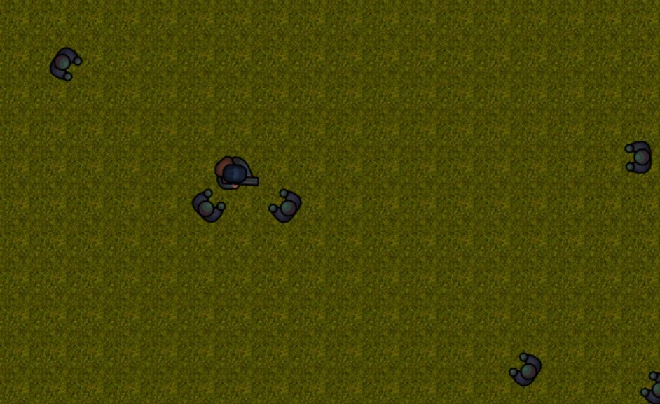

## Zomblocks Hackathon

A simple top-down shooter game made from ground-up by me as a hackathon and a challenge project. Drawing heavily from my Unity experience, implementing everything in OOP TS.

The aim for MVP after 24hrs of work:

1. My own UI, Draw and Level managers
2. Single-player, 3 weapons, day-night cycle, shop
3. Zombies spawning during the night, flow field path finding, large amounts
4. Endless survival and menu with proper credits

### Play now!

[Click here to play right now in your browser!](https://deniskabana.github.io/hackathon-zomblox-ts/)

### Screenshot

<div align="center">
  
</div>

### Development

Designed for `node@22.20.0` and `yarn@4.10.3`. Only using dependencies for development experience and automation.

```bash
$ yarn
$ yarn dev
```

Open http://localhost:5173/ to start development.
