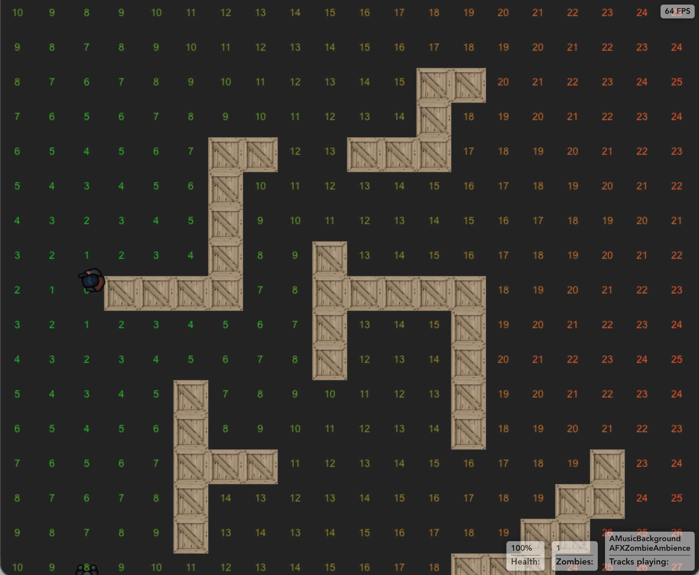

> [!CAUTION]
> This codebase has been long abandoned in favor of a new, multiplayer-centric codebase that is not open-source. Documentation is also outdated.

This code serves as a showcase of how I started working on Zomblocks and why it was a bad idea to make my own engine. I still don't regret it.

- Try the **current version of Zomblocks** here: https://alpha.zomblocks.fun/
- The last public version from this codebase is here: https://beta.zomblocks.fun/

---

## Zomblocks Hackathon

A simple top-down shooter game made from ground-up by me as a hackathon and a challenge project. Drawing heavily from my Unity experience, implementing everything in OOP TS.

The aim for MVP after 24hrs of work:

1. My own UI, Draw and Level managers
2. Single-player, 3 weapons, day-night cycle, shop
3. Zombies spawning during the night, flow field path finding, large amounts
4. Endless survival and menu with proper credits


### Development

Designed for `node@22.20.0` and `yarn@4.10.3`. Only using dependencies for development experience and automation.

```bash
$ yarn
$ yarn dev
```

Open http://localhost:5173/ to start development.

### More info

<div align="center">
  
  <p>Flow field pathfinding</p>
</div>
